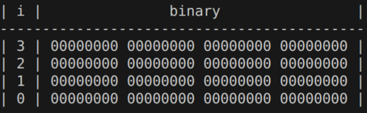
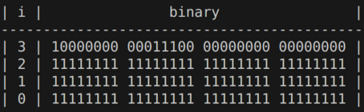
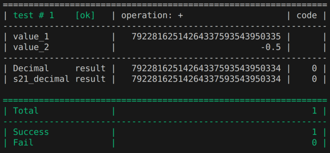
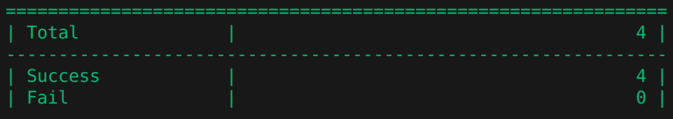
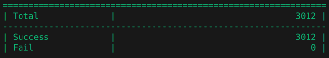

## Класс s21::Decimal

### Конструкторы 
- по умолчанию (нулевой Decimal): `s21::Decimal d1;`
- копирования: `s21::Decimal d2(d1);`
- из строки: `s21::Decimal d3("79228162514264337593543950335");`
- список инициализации: `s21::Decimal d4{1, 2, 3, 0};`
- список инициализации: `s21::Decimal d5{0xFFFFFFFF, 0xFFFFFFFF, 0xFFFFFFFF, 0x801C0000};`
- из типа long: `s21::Decimal d6(2147483648);`
- из типа float: `s21::Decimal d7(3.1415926535f);`
- из типа s21_decimal: `s21::Decimal d8(&s21_decimal_var);`
- пользовательский литерал: `"-7.9228162514264337593543950335"_d;`

### Печать 
- двоичный формат (`d1.printBitsBinary();`):<br>


- десятичный формат в виде структуры (`d5.printBitsUint();`):<br>
{ 4294967295, 4294967295, 4294967295, 2149318656 }

- шестнадцатиричный формат в виде структуры (`d5.printBitsHex();`):<br>
{ 0xFFFFFFFF, 0xFFFFFFFF, 0xFFFFFFFF, 0x801C0000 }

- десятичный формат (`d5.print();`):<br>
-7.9228162514264337593543950335

- десятичный формат (`std::cout << d5 << std::endl;`):<br>
-7.9228162514264337593543950335

- двоичный формат (`"-7.9228162514264337593543950335"_d.printBitsBinary();`):<br>



### Арифметические операции (+, -, *, /)
- переменные (`std::cout << d4 + d5 << std::endl;`):<br>
55340232229718589433.077183749

- литералы (`std::cout << "-7.9228162514264337593543950335"_d + "-7.9"_d << std::endl;`):<br>
-15.822816251426433759354395034

- литералы (`std::cout << "-7.9228162514264337593543950335"_d + 2147483648 << std::endl;`):<br>
2147483640.0771837485735662406

### Операции сравнения (<, <=, >, >=, ==, !=)
- переменные (`std::cout << (d4 >= d5) << std::endl;`):<br>
1

- литералы (`std::cout << ("-7.9228162514264337593543950335"_d == "-7.9"_d) << std::endl;`):<br>
0

- литералы (`std::cout << ("-7.9228162514264337593543950335"_d < 2147483648) << std::endl;`):<br>
1

### Преобразователи
- в тип int:
```bash
  auto [ivar, err_code1] = "-2147483648"_d.toInt();
  std::cout << "result: " << ivar << ", " << err_code1 << std::endl;
```
result: -2147483648, 0

- в тип float:
```bash
  auto [fvar, err_code2] = "3.1415926535"_d.toFloat();
  std::cout << std::setprecision(11) << "result: " << fvar << ", " << err_code2 << std::endl;
```
result: 3.141592741, 0

- в тип std::string:
```bash
  std::cout << "-7.9228162514264337593543950335"_d.toString() << std::endl;
```
-7.9228162514264337593543950335

- в тип s21_decimal:
```bash
  s21_decimal result;
  "-7.9228162514264337593543950335"_d.to_s21_decimal(&result);
```

### Другие функции
- round (`std::cout << "3.1415926535"_d.round() << std::endl;`):<br>
3

- floor (`std::cout << "-3.1415926535"_d.floor() << std::endl;`):<br>
-4

- truncate (`std::cout << "3.999999999"_d.truncate() << std::endl;`):<br>
3

- negate (`std::cout << "3.1415926535"_d.negate() << std::endl;`):<br>
-3.1415926535

### Тесты (для тестирования нужно в макфайле указать путь к библиотеке `s21_decimal.a`)
- вся арифметика:
```bash
  run_test<ArithmeticTest>("79228162514264337593543950335"_d, "-0.5"_d);
```

- арифметика на выбор (+, -, *, /):
```bash
  run_test<ArithmeticTest>("79228162514264337593543950335"_d, "-0.5"_d, "+");
  run_test<ArithmeticTest>("79228162514264337593543950335"_d, "-0.5"_d, "-");
  run_test<ArithmeticTest>("79228162514264337593543950335"_d, "-0.5"_d, "*");
  run_test<ArithmeticTest>("79228162514264337593543950335"_d, "-0.5"_d, "/");
```

- функции сравнения все или по выбору (<, <=, >, >=, ==, !=):
```bash
  run_test<ComparisonTest>("79228162514264337593543950335"_d, "-0.5"_d);
  run_test<ComparisonTest>("79228162514264337593543950335"_d, "-0.5"_d, ">=");
```

- другие функции все или по выбору ("floor", "round", "truncate", "negate"):
```bash
  run_test<OtherTest>("792281625142643.37593543950335"_d);
  run_test<OtherTest>("792281625142643.37593543950335"_d, "floor");
```

- функции преобразования из s21::Decimal все или по выбору ("from_decimal_to_int", "from_decimal_to_float"):
```bash
  run_test<FromDecimalTest>("7922816531.37593543950335"_d);
  run_test<FromDecimalTest>("7922816531.37593543950335"_d, "from_decimal_to_int");
```

- функция преобразования из типа int:
```bash
  run_test<FromIntTest>(1520);
```

- функция преобразования из типа float:
```bash
  run_test<FromFloatTest>(79228172514264337593543950335.0f);
```

- вывод всех результатов теста (по умолчанию выводятся только ошибки):
```bash
  BaseTest::PrintAllResults = true;
```

- вывод итога:
```bash
  general_results();
```

### Запуск тестов
- сложение с полным выводом:
```bash
  BaseTest::PrintAllResults = true;
  run_test<ArithmeticTest>("79228162514264337593543950335"_d, "-0.5"_d, "+");
  general_results();
```


- вся арифметика с выводом только ошибок:
```bash
  BaseTest::PrintAllResults = false;
  run_test<ArithmeticTest>("79228162514264337593543950335"_d, "-0.5"_d);
  general_results();
```


### Цели тестирования
- цель `make test`:<br>
скомпилирует файл `tests/test.cpp` с пользовательскими единичными тестами.

- цель `make test_loop`:<br>
скомпилирует файл `tests/test_loop.cpp` с цикличными тестами. Массивы данных находятся в том же файле. Выполняется перебор всех элементов массивов и выполнение с ними всех возможных операций.<br>
Результат:<br>
